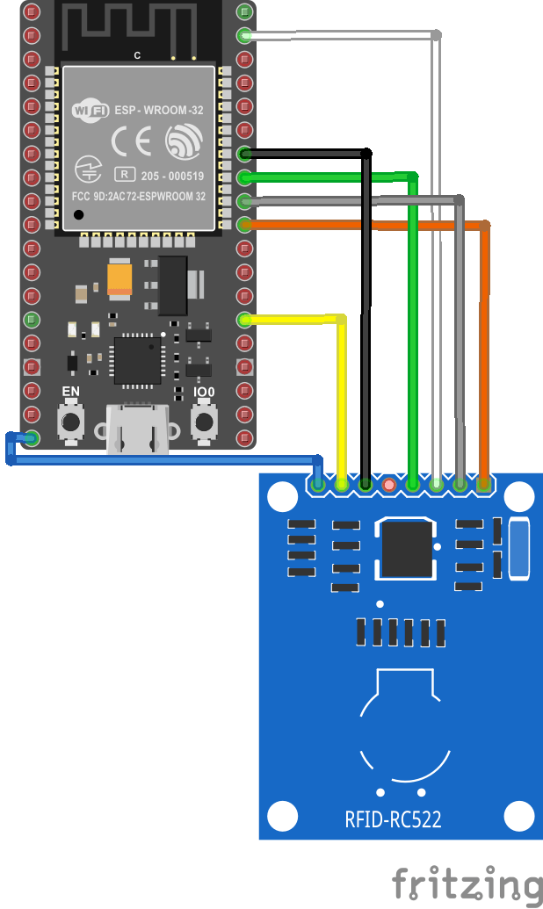

# esp32-RFID-pub-sub

## Description

The goal of this project is to implement a wearable IoT product with our own Pub/Sub networking model. This means that we cannot use MQTT or any other protocol to transfer data from our device. 

We decided to implement a name-tag reader using an RFID reader and the ESP32 microprocessor for our design. The BeagleBone Black would be our server, database, and broker for the publisher and subscriber. A C# winforms application would serve as our client. 

---

## Design

 

---
## Required Hardware
* ESP32 Microprocessor with WiFi Enabled
* RFID-RC522
* 13.56MHz White IC Card
* BeagleBone Black with Ethernet or WiFi Enabled
* Jumper Wires